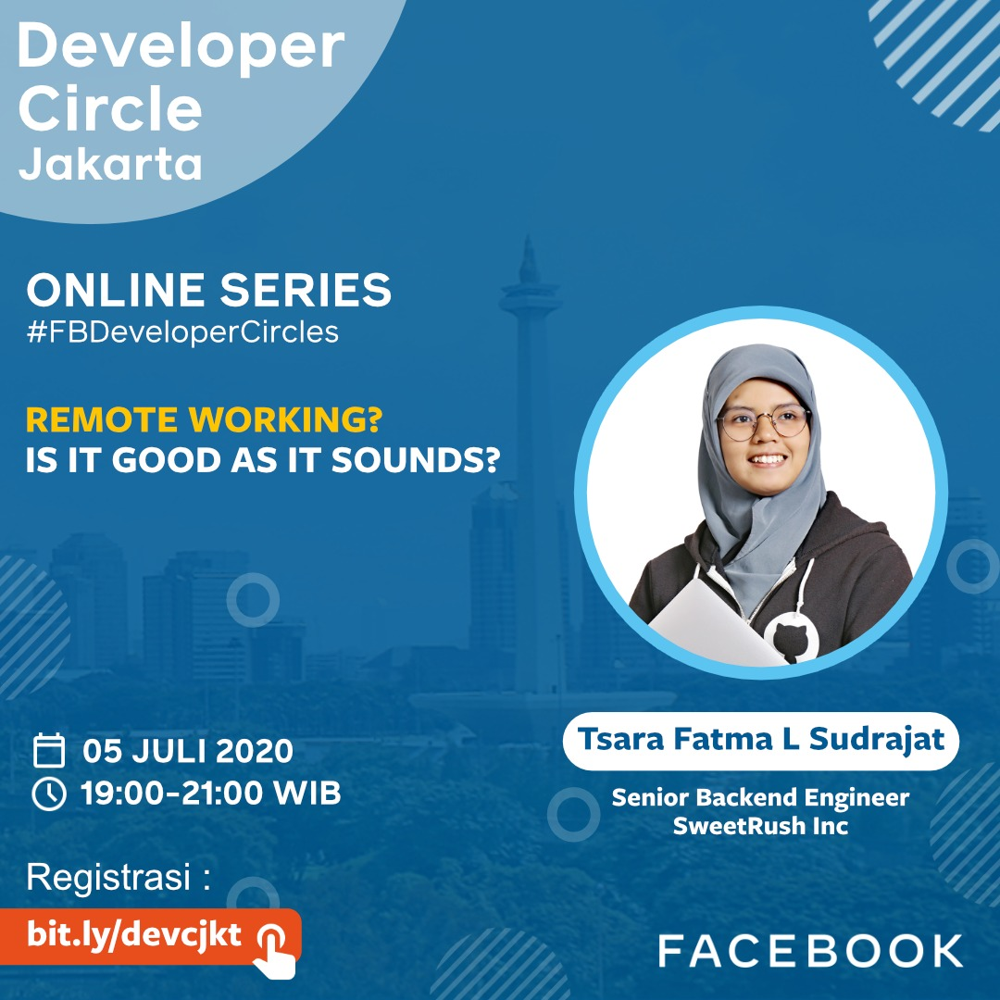

# Developer Circle Jakarta - Public Data

Developer Circle Jakarta - Public Data

## Last Event

## Daftar Event 2020

see [events.json](events.json)

- [Online series #10: Remote Working? Is it good as it souds?](#online-series-10-remote-working-is-it-good-as-it-souds)
- [Online series #9: Ask Me Anything](#online-series-9-ask-me-anything)
- [Online series #8: How to Think in Functional Programming](#online-series-8-how-to-think-in-functional-programming)
- [Online series #7: Stay Productive & Work Live Balance](#online-series-7-stay-productive-work-live-balance)
- [Online series #6: Introduction to Text Classification; Programmer punya Prinsip, Prinsip SOLID.](#online-series-6-introduction-to-text-classification-programmer-punya-prinsip-prinsip-solid)
- [Online series #5: UX Prototyping - Belajar React dari sisi desain](#online-series-5-ux-prototyping-belajar-react-dari-sisi-desain)
- [Online series #4: Unit Testing for Backend](#online-series-4-unit-testing-for-backend)
- [Online series #3: Unit Testing for Frontend](#online-series-3-unit-testing-for-frontend)
- [Online series #2: Kubernetes for beginner](#online-series-2-kubernetes-for-beginner)
- [Online series #1: Playing with React360](#online-series-1-playing-with-react360)
- [Onsite Mentoring Study Group #studyjam 2](#onsite-mentoring-study-group-studyjam-2)
- [International Women's Day 2020](#international-women-s-day-2020)
- [Onsite Mentoring Study Group #studyjam](#onsite-mentoring-study-group-studyjam)
- [Mentoring Session Batch 3](#mentoring-session-batch-3)
- [Build your own personal website using Gatsby](#build-your-own-personal-website-using-gatsby)

### Online series #10: Remote Working? Is it good as it souds?

- Tanggal: 2020/07/05
- Pukul: 19:00 - 21:00
- Pembicara: 
  - Tsara Fatma L Sudrajat, Senior Rails Developer, working remotely for a US company.

### Online series #9: Ask Me Anything

- Tanggal: 2020/06/28
- Pukul: 19:00 - 21:00
- Pembicara: 
  - Luri Darmawan, Creator, Carik
- https://web.facebook.com/events/2901069809992075/
- Registration: https://us02web.zoom.us/meeting/register/tZAqfuyrqT4iE9zXSvNY9m9l07YpHbtqqudp
- video: https://web.facebook.com/groups/DevCJakarta/permalink/940725683018863/
- QnA: https://web.facebook.com/groups/DevCJakarta/permalink/924240681334030/

### Online series #8: How to Think in Functional Programming

- Tanggal: 2020/06/20
- Pukul: 13:00 - 15:00
- Pembicara: 
  - Fachrin Aulia Nasution, Product Engineer, Gojek
- https://web.facebook.com/events/554379655443696/
- Presentation: https://docs.google.com/presentation/d/1K4gw3ityYnprraGSHzOqdGK3CPTW3IA-j9h0qM3DF5g/edit?usp=sharing

### Online series #7: Stay Productive & Work Live Balance

- Tanggal: 2020/06/13
- Pukul: 13:00 - 15:00
- Pembicara: 
  - Aji Imawan Omi, Software Enginer, Tokopedia
- https://web.facebook.com/events/779713232561495
- video: https://web.facebook.com/groups/DevCJakarta/permalink/929927814098650/
- QnA: https://web.facebook.com/groups/DevCJakarta/permalink/929936337431131
- Presentation: https://docs.google.com/presentation/d/1S9JFbO6wL5XWoTW-IE92_ez63hVtJs0yCwBdzFMDaZs/edit#slide=id.g35f391192_00

### Online series #6: Introduction to Text Classification; Programmer punya Prinsip, Prinsip SOLID.

- Tanggal: 2020/05/30
- Pukul: 13:00 - 15:00
- Pembicara: 
  - Mufti Ismi Rizqi, Product Engineer, Gojek
  - Luthfi Mahendra, Machine Learning Engineer, Bytedance
- https://web.facebook.com/events/2629255574057118/
- video: https://web.facebook.com/groups/DevCJakarta/permalink/919535918471173/
- QnA: https://web.facebook.com/groups/DevCJakarta/permalink/919540688470696/

### Online series #5: UX Prototyping - Belajar React dari sisi desain

- Tanggal: 2020/05/16
- Pukul: 13:00 - 15:00
- Pembicara: Sonny Lazuardi, Lead UX Engineer, Grab
- https://web.facebook.com/events/557959478256856
- video: https://www.facebook.com/groups/DevCJakarta/permalink/905988843159214/
- QnA: https://www.facebook.com/groups/DevCJakarta/permalink/905990726492359/

### Online series #4: Unit Testing for Backend

- Tanggal: 2020/05/09
- Pukul: 13:00 - 15:00
- Pembicara: Fascal Sapty, Software Engineer, Doku
- https://web.facebook.com/events/2341509266147247
- video: https://www.facebook.com/groups/DevCJakarta/permalink/901216390303126
- QnA: https://www.facebook.com/groups/DevCJakarta/permalink/901224510302314

### Online series #3: Unit Testing for Frontend

- Tanggal: 2020/05/02
- Pukul: 13:00 - 14:00
- Pembicara: Ryan Rynaldo, Software Engineer, Bukalapak
- https://www.facebook.com/events/527387501284134
- video: https://www.facebook.com/groups/DevCJakarta/permalink/896314084126690
- QnA: https://www.facebook.com/groups/DevCJakarta/permalink/896321094125989

### Online series #2: Kubernetes for beginner

- Tanggal: 2020/04/25
- Pukul: 13:00 - 14:00
- Pembicara: Gazandi Cahyadarma, Sofware Engineer, Bukalapak
- https://web.facebook.com/events/826776221164017/

### Online series #1: Playing with React360

- Tanggal: 2020/04/18
- Pukul: 17:00 - 18:00
- Pembicara: Rizal Ibnu, Frontend Enginer, Kumparan
- https://web.facebook.com/events/673643483180170/

### Onsite Mentoring Study Group #studyjam 2

- Tanggal: 2020/03/14
- Pukul: 12:00 - 17:00
- Pembicara: 
  - All Mentor, DevC
- https://web.facebook.com/events/2337935356447102/

### International Women's Day 2020

- Tanggal: 2020/03/07
- Pukul: 12:00 - 18:00
- Pembicara: 
  - Henny Limbong, Big Data Project Manager & Data Analyst, OVO
  - Noni Marine, Software Quality Assurance, TADA
  - Yolanda Septiani, Mobile Application Developer, Bukalapak
- https://web.facebook.com/events/572985089958593/
- Registration: https://iwd2020devcfg.splashthat.com 

### Onsite Mentoring Study Group #studyjam

- Tanggal: 2020/02/29
- Pukul: 12:00 - 17:00
- Pembicara: 
  - All Mentor, DevC
- https://web.facebook.com/events/574253526499524/

### Mentoring Session Batch 3

- Tanggal: 2020/02/15
- Pukul: 15:00 - 20:00
- Pembicara: 
  - Reno Putra Prawira, Software Engineer, Kumparan
  - Adrian Edbert Luman, Data Engineer, Vidio
  - Muhammad Aisy, Software Engineer, PT. Satkomindo
  - Maksum Rifai, Supervisor IT, Penthouse
  - Muhibbudin Suretno, Software Engineer, Orori
  - Luthfi Mahendra, ML Engineer, Bytedance
  - Ihsan Satriawan, Software Engineer, Tokopedia
  - Khairunissa, Fullstack Engineer, BTPN
  - Chrysilla Mayasari, Frontend Engineer, Gojek
  - Wahyu Tri Laksono, Software Engineer, Bank Mandiri
- https://web.facebook.com/events/1265734030291730/

### Build your own personal website using Gatsby

- Tanggal: 2020/01/25
- Pukul: 13:00 - 17:00
- Pembicara: 
  - Muhibbudin Suretno, Senior Software Engineer, ORORI.com
- https://web.facebook.com/events/163530268308983/

## Bantu kami

Bantu kami memperbarui daftar ini 🙏

Pantau grup [Facebook Developer Circle Jakarta](https://www.facebook.com/groups/devcjakarta) dan silahkan perbarui data setiap kali ada sesi baru.

Kami sangat berterima kasih untuk setiap bantuan yang teman-teman berikan.

----

©️ 2020 by DevC Jakarta Team